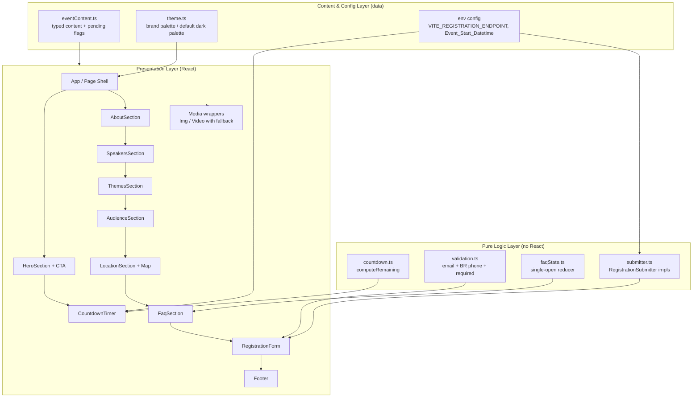

# Design Document

## Overview

This document describes the design for the **Navecon Contabilidade** event landing page — a responsive, dark-themed, single-page marketing site (pt-BR) for the in-person event _"Imersão Presencial com Mailson Junior e Fabio Edelberg"_ (16–17 September 2026, Navecon Contabilidade – Unidade Brusque).

The page is a static, client-rendered marketing site. Its primary goal is conversion (event registrations), so the architecture prioritizes fast first paint, a credible dark visual identity, and a frictionless registration flow. A defining constraint is that **several content pieces are still pending** (event time, About detail, Themes, Target Audience, brand colors, speaker photos, contact details). The design treats content as **data, not markup**: every section reads from a single typed content configuration and renders either finalized content or a `Pending_Content_State` placeholder. This lets content be filled in later by editing one config object, with no structural or layout changes.

### Stack Recommendation (needs user confirmation)

> **⚠️ Assumption flagged for confirmation.** The requirements do not specify a tech stack. This design assumes the stack below. If you prefer plain HTML/CSS/JS or Next.js, say so and the design adapts — the component breakdown and content model stay largely the same.

**Recommended stack: Vite + React + TypeScript.**

| Need | How the stack satisfies it |
| --- | --- |
| Live countdown timer | A small pure `computeRemaining(now, target)` function + a React hook driving a 1s interval. Pure math is trivially unit/property-testable in isolation. |
| FAQ accordion (single-open) | Local component state (`openIndex`) — no library needed. The single-open rule is a pure reducer, easy to property-test. |
| Embedded map | Google Maps embed `<iframe>` (no API key for basic embed) with an `onError` fallback to a static address + "open in Maps" link. |
| Form validation | Pure validator functions (email, BR phone) in TypeScript, fully decoupled from React and property-testable. |
| Responsive layout | CSS with mobile-first breakpoints + CSS custom properties for theming. No CSS framework required; optionally Tailwind if preferred. |
| Local media from `public/` | Vite serves everything under `public/` at the site root with stable relative paths and copies it verbatim into the build. Perfect fit for Req 14. |
| Static hosting | `vite build` emits a static bundle deployable to any static host (Netlify, Vercel, S3, GitHub Pages). |

**Why not alternatives:**
- _Plain HTML/CSS/JS_ — viable and zero-dependency, but the countdown, accordion, form state, and content-driven rendering grow into hand-rolled DOM code that is harder to unit/property-test. React makes the pending-content logic declarative.
- _Next.js static export_ — heavier than needed for a single static page with no routing or SSR data needs. Vite is leaner and faster to build for this scope.

**Testing tooling:** Vitest (test runner, shares Vite config) + fast-check (property-based testing) + React Testing Library (component behavior).

### Form Backend Approach (needs user confirmation)

> **⚠️ Assumption flagged for confirmation.** The requirements do not specify where registration data goes.

The form submits through a single **configurable async submit handler** behind a `RegistrationSubmitter` interface:

```ts
type SubmitResult = { ok: true } | { ok: false; reason: string };
interface RegistrationSubmitter {
  submit(payload: RegistrationPayload, signal: AbortSignal): Promise<SubmitResult>;
}
```

The concrete implementation is selected by an environment variable (`VITE_REGISTRATION_ENDPOINT`). Recommended default: an **HTTP POST to a configurable webhook/form-service endpoint** (e.g., Formspree, a Google Apps Script web app, or a custom serverless function). This satisfies the success/error/validation/timeout requirements (Req 10) without committing to a backend:
- If `VITE_REGISTRATION_ENDPOINT` is set → `HttpSubmitter` POSTs JSON to it.
- If unset → `PlaceholderSubmitter` simulates a successful submission and logs the payload (so the page is fully functional in development/preview).

The submitter enforces a 30-second timeout via `AbortSignal` (Req 10.7). The UI layer never knows the destination — only the interface — so swapping providers later is a one-line config change.

## Architecture

The application is a single-page, component-based SPA with a strict separation between **pure logic** (testable, framework-free) and **presentation** (React components). All event content flows from one typed configuration object.



### Architectural principles

1. **Content as data.** Sections never hardcode pending/finalized branching in markup. They receive content props derived from `eventContent.ts` and a resolver decides finalized-vs-pending. Filling in content = editing config (Req 5, 7, 8, 13, 3.5/3.6).
2. **Pure logic is isolated and testable.** Countdown math, validation, and the FAQ single-open rule live in plain TypeScript modules with no React/DOM imports. These are the targets for property-based testing.
3. **Graceful media degradation.** Every image/video is rendered through a wrapper that reserves layout space and swaps to a fallback on error/timeout, so media never blocks the page (Req 14).
4. **Theming via CSS custom properties.** A single `:root` palette (default dark or brand-provided) drives headings, CTAs, and accents (Req 1.6/1.7).
5. **Single source of truth for the event date.** `Event_Start_Datetime` is computed once in Brasília time (UTC−03:00) and shared by the countdown (Req 4.4/4.5).

### Rendering & load strategy

- The page shell, theme, and text content render immediately. Media (logo, photos, videos, map iframe) load asynchronously and never block section rendering (Req 14.3, 2 reflow).
- Layout uses CSS Grid/Flexbox with mobile-first breakpoints at **768px** (single vs multi-column) so reflow is handled by the browser without JS or reload (Req 2.1, 2.2, 2.5).
- A skip-free single document with semantic landmarks (`<header>`, `<main>`, `<section>`, `<footer>`) supports accessibility and the required top-to-bottom order (Req 1.1).

## Components and Interfaces

### Page shell — `App`
- Sets `<html lang="pt-BR">` and document `<title>` (Req 1.5).
- Applies the theme palette to `:root` (Req 1.6/1.7).
- Renders sections in the fixed order: Hero → About → Speakers → Themes → Audience → Location → FAQ → Registration → Footer (Req 1.1).
- Hosts a `formRef` used by all CTAs to scroll to and focus the form (Req 9).

### `HeroSection`
- Props: event name, speakers, dates, location, `eventTime | null`.
- Renders event name, both speaker names, dates, venue (Req 3.1–3.4).
- Event time: shows `HH:MM` when defined, else the pending label `"Horário a definir"` (Req 3.5/3.6).
- Contains the primary `RegistrationCta` and the `CountdownTimer`; CTA must be within the initial viewport (Req 3.8) — enforced via hero min-height and CTA placement above the fold.

### `RegistrationCta` (shared)
- A single reusable component used in both Hero and the below-Audience position (Req 9.1/9.2), guaranteeing **identical label wording** across instances (Req 9.3) because the label is a shared constant.
- On click/tap/Enter/Space (Req 9.4) it calls `scrollToForm(formRef)`:
  - If the form top is not within the viewport → smooth-scroll so the form top enters the viewport, then focus the first input (Req 9.4–9.6).
  - If the form is already fully visible → keep scroll position, just focus the first input (Req 9.7).
- Rendered as a real `<button>`/`<a>` for keyboard activation; min 44×44px touch target on mobile (Req 2.6).

### `CountdownTimer`
- Consumes `computeRemaining(now, eventStart)` from `countdown.ts`.
- Drives a `setInterval` ticking at 1000ms (Req 4.2); cleans up on unmount.
- Renders four zero-padded (min 2 digits) fields: days, hours (0–23), minutes (0–59), seconds (0–59) (Req 4.1).
- When `now >= eventStart`, stops ticking, shows all zeros and a started-state message (Req 4.3, 4.6).

### `AboutSection`
- Heading `"Sobre o Evento"` + fixed format summary (two-day in-person immersion, dates, venue) (Req 5.1/5.2).
- Resolver shows finalized detail **or** the pending placeholder, never both (Req 5.3–5.5).

### `SpeakersSection`
- Heading `"Quem são os palestrantes"`; renders exactly two speaker entries (Req 6.1/6.4).
- Entry 1: "Fabio Edelberg" + "CEO da Navecon Contabilidade"; Entry 2: "Mailson Junior" + "Fundador do Império Moda Atacadista" (Req 6.2/6.3).
- Each entry renders the provided photo or a placeholder image, always with alt text naming the speaker (Req 6.5/6.6) via the `Media` wrapper.

### `ThemesSection`
- Heading `"Temas abordados"` (Req 7.1).
- Renders 1–20 defined themes as distinct items in declared order (Req 7.2/7.3); empty/undefined → pending placeholder (Req 7.4).

### `AudienceSection`
- Heading `"Para quem é"` (Req 8.1).
- Renders ≥1 audience descriptions as distinct items, or the pending placeholder when none — never both (Req 8.2–8.4).

### `LocationSection`
- Full venue address text (Req 11.1).
- Embedded Google Maps `<iframe>` centered on the venue with a marker (Req 11.2); clicking opens the venue in an external map service in a new tab (`target="_blank" rel="noopener"`) (Req 11.3).
- On iframe load error → fallback with address text + external-map link, rest of section stays visible (Req 11.4).

### `FaqSection`
- Heading + ≥3 question items (Req 12.1); finalized content or ≥3 pending placeholder items with identical expand/collapse behavior (Req 12.6).
- Uses `faqState.ts` single-open reducer: all collapsed initially (Req 12.4); activating a collapsed item expands it and collapses any other (Req 12.2/12.5); activating an expanded item collapses it (Req 12.3).
- Implemented with accessible `<button>` headers (`aria-expanded`, `aria-controls`); animation ≤500ms via CSS transition.

### `RegistrationForm`
- Fields: full name (req, ≤100), email (req, ≤254), phone (req, ≤11 digits), company (optional, ≤100) (Req 10.1).
- Uses validators from `validation.ts`. On submit:
  - Validates all rules; on failure shows per-field messages and retains all entered values (Req 10.3–10.5).
  - On valid submit: disables submit control (Req 10.6), calls the `RegistrationSubmitter` with a 30s `AbortSignal`.
  - Success → success message within 5s (Req 10.2).
  - Failure/timeout/rejection → error message, re-enable submit, retain values (Req 10.7).
- First input is `firstInputRef` (focus target for CTAs, Req 9.6).

### `Footer`
- "Navecon Contabilidade", full Brusque address, light logo (Req 13.1–13.3).
- Logo load failure → fallback placeholder, rest stays visible (Req 13.4).
- Contact details: render each provided item, or pending placeholder when none (Req 13.5/13.6).

### `Media` wrappers — `SafeImage`, `SafeVideo`
- Reserve fixed dimensions to prevent layout shift; render fallback placeholder of equal dimensions on error or 10s timeout, keeping the page interactive (Req 14.3–14.5).
- For the logo specifically, the image fallback renders the event name as text (Req 1.4) or a placeholder block (Req 13.4) depending on placement.

### Pure logic modules (framework-free)

```ts
// countdown.ts
interface Remaining { total: number; days: number; hours: number; minutes: number; seconds: number; started: boolean; }
function computeRemaining(nowMs: number, targetMs: number): Remaining;
function pad2(n: number): string;

// validation.ts
function isNonEmpty(value: string): boolean;            // rejects whitespace-only
function isValidEmail(value: string): boolean;          // exactly one '@', non-empty local, domain has a dot
function isValidBrazilPhone(value: string): boolean;    // 10 or 11 digits incl 2-digit DDD
function validateRegistration(input: RegistrationInput): ValidationResult;

// faqState.ts
function toggle(state: number | null, index: number): number | null; // single-open reducer
```

## Data Models

### Content configuration model

All event content and pending flags live in one typed object. Resolvers convert raw content into a discriminated "finalized | pending" state per section.

```ts
// A generic resolved content state used by content-driven sections
type Resolved<T> =
  | { status: "finalized"; value: T }
  | { status: "pending"; message: string };

interface SpeakerContent {
  name: string;
  role: string;
  photoSrc: string | null;   // null → placeholder image
}

interface ContactDetail {
  kind: "phone" | "email" | "instagram" | "whatsapp" | "other";
  label: string;
  href?: string;
}

interface FaqItem {
  question: string;
  answer: string;
}

interface EventContent {
  // Fixed, known-now content
  eventName: string;                 // "Imersão Presencial com Mailson Junior e Fabio Edelberg"
  speakerNames: [string, string];    // ["Fabio Edelberg", "Mailson Junior"]
  dateLabel: string;                 // "16 e 17 de setembro de 2026"
  venueLabel: string;                // "Navecon Contabilidade – Unidade Brusque"
  fullAddress: string;               // "Av. 1º de Maio, 38 – Sala 12 – Centro 2, Brusque – SC, CEP 88353202"

  // Pending-capable content (null/empty → pending state)
  eventTime: string | null;          // "HH:MM" or null → "Horário a definir"
  aboutDetail: string | null;        // null → pending placeholder
  themes: string[];                  // [] → pending; 1..20 items otherwise
  audience: string[];                // [] → pending
  speakers: [SpeakerContent, SpeakerContent];
  faq: FaqItem[];                    // length < 3 → use placeholder set
  contacts: ContactDetail[];         // [] → pending

  // Event timing
  eventStartDatetime: string;        // ISO with -03:00, e.g. "2026-09-16T00:00:00-03:00"
}
```

### Pending content state model

A single helper centralizes the pending-vs-finalized decision so behavior is uniform across sections (Req 5, 7, 8, 13, 3.5/3.6):

```ts
const PENDING_MESSAGES = {
  about:    "Descrição detalhada em breve.",
  themes:   "Temas em breve.",
  audience: "Conteúdo em breve.",
  contacts: "Informações de contato em breve.",
  eventTime: "Horário a definir",
} as const;

// Returns finalized when content is "present", else pending.
function resolveText(value: string | null, pendingMsg: string): Resolved<string>;
function resolveList(items: string[], pendingMsg: string): Resolved<string[]>; // empty → pending
```

Rules encoded by resolvers:
- A string is "present" only if it is non-null and not whitespace-only.
- A list is "present" only if it has ≥1 element (themes additionally capped at 20 for display).
- The pending and finalized states are mutually exclusive by construction (a `Resolved<T>` is one or the other) — directly satisfying "not both simultaneously" (Req 5.5, 8.4).

### Theme model

```ts
interface ThemePalette {
  background: string;   // dark base
  surface: string;      // cards/sections
  textPrimary: string;  // ≥4.5:1 on background
  textLarge: string;    // ≥3:1 for large text
  accent: string;       // headings / section accents
  ctaBg: string;        // Registration CTA
  ctaText: string;      // ≥4.5:1 on ctaBg
}
// brandPalette?: ThemePalette  (Req 1.6) else DEFAULT_DARK_PALETTE (Req 1.7)
```

Palette values are applied as CSS custom properties on `:root`. The default dark palette is chosen so body text meets ≥4.5:1 and large text/controls meet ≥3:1 (Req 1.2).

### Registration model

```ts
interface RegistrationInput {
  fullName: string;   // required, ≤100
  email: string;      // required, ≤254
  phone: string;      // required, raw input; normalized to digits for validation; ≤11 digits
  company: string;    // optional, ≤100
}

interface FieldErrors {
  fullName?: string;
  email?: string;
  phone?: string;
}

type ValidationResult =
  | { valid: true; value: RegistrationPayload }
  | { valid: false; errors: FieldErrors };

interface RegistrationPayload {
  fullName: string;
  email: string;
  phoneDigits: string;  // normalized digits only
  company: string | null;
}
```

### Asset model & handling

Assets currently in `info/` are moved into the project's public assets directory during implementation and referenced by stable relative paths (Req 14.1/14.2):

| Source (info/) | Destination (`public/assets/...`) | Usage |
| --- | --- | --- |
| `icon-light.png` | `public/assets/logo/icon-light.png` | Header + Footer logo (dark theme) |
| `icon-dark.png` | `public/assets/logo/icon-dark.png` | Reserved (light-on-light contexts; not used by default) |
| `Evento.mp4` | `public/assets/video/evento.mp4` | Hero/About ambient video |
| `IMG_2212.MP4` | `public/assets/video/img-2212.mp4` | Ambient gallery |
| `IMG_4226.MP4` | `public/assets/video/img-4226.mp4` | Ambient gallery |
| `WhatsApp Image ...14.18.17.jpeg` | `public/assets/gallery/ambient-1.jpeg` | Ambient imagery |
| `WhatsApp Image ...11.31.22.jpeg` | `public/assets/gallery/ambient-2.jpeg` | Ambient imagery |

Files are renamed to lowercase, hyphenated, space-free names for reliable relative-path resolution. An `assets.ts` map centralizes paths so a missing/renamed asset is changed in one place. Every asset renders through `SafeImage`/`SafeVideo` so unresolved paths show a fallback with a visible "media unavailable" indication without blocking rendering (Req 14.4/14.5).

## Correctness Properties

_A property is a characteristic or behavior that should hold true across all valid executions of a system — essentially, a formal statement about what the system should do. Properties serve as the bridge between human-readable specifications and machine-verifiable correctness guarantees._

These properties apply to this feature's **pure logic layer only** — countdown math, content resolvers, list rendering, form validators, and the FAQ single-open reducer. The bulk of the requirements describe fixed-content rendering, responsive layout, async UI states, and configuration; those are covered by example, edge-case, and smoke tests in the Testing Strategy rather than by properties. The prework analysis consolidated overlapping criteria into the seven non-redundant properties below.

### Property 1: Countdown computation is correct for all instants

_For any_ pair of instants `now` and `target`:
- when `now < target`, `computeRemaining` yields `days >= 0`, `hours` in `0..23`, `minutes` in `0..59`, `seconds` in `0..59`, `started = false`, and the four fields recompose exactly to the floored remaining seconds (`days*86400 + hours*3600 + minutes*60 + seconds == floor((target - now)/1000)`);
- when `now >= target`, all four fields are `0` and `started = true`;
- and `pad2` of every field produces a string of length `>= 2`.

**Validates: Requirements 4.1, 4.3, 4.6**

### Property 2: Content resolver yields exactly one of finalized or pending

_For any_ content value (a `string | null` for text sections, or a `string[]` for list sections), the resolver returns the `pending` state when the value is absent (null, whitespace-only string, or empty list) and the `finalized` state otherwise — never both and never neither. Consequently, a section in the pending state renders no finalized content, and a section in the finalized state renders no pending placeholder.

**Validates: Requirements 5.3, 5.4, 5.5, 7.4, 8.3, 8.4, 13.6**

### Property 3: List sections render every item once, in order

_For any_ non-empty list of content items (themes 1..20, audience descriptions, or contact details), the rendered output contains exactly one distinct item per input element, with no items added or dropped, and in the same order as the input.

**Validates: Requirements 7.2, 7.3, 8.2, 13.5**

### Property 4: Email validation accepts well-formed and rejects malformed addresses

_For any_ generated email string, `isValidEmail` returns true if and only if the string contains exactly one "@" that separates a non-empty local part from a domain part containing at least one dot. Strings with zero or multiple "@", an empty local part, or a domain without a dot are rejected.

**Validates: Requirements 10.4**

### Property 5: Brazilian phone validation depends only on digit count

_For any_ phone input string, `isValidBrazilPhone` returns true if and only if the string, reduced to its numeric digits, has a length of exactly 10 or 11 (a 2-digit DDD plus an 8- or 9-digit number). Non-digit characters (spaces, parentheses, dashes, "+") do not affect the result other than being stripped before counting.

**Validates: Requirements 10.5**

### Property 6: Registration validation flags exactly the invalid required fields and never mutates input

_For any_ `RegistrationInput`, `validateRegistration` marks `fullName`, `email`, or `phone` invalid exactly when that field is empty/whitespace-only (or, for email/phone, fails its format rule), produces no error for the optional `company` field, returns `valid: true` only when all required fields pass, and leaves the input object unmodified so the UI can retain entered values.

**Validates: Requirements 10.1, 10.3**

### Property 7: FAQ accordion keeps at most one item open

_For any_ number of FAQ items and _any_ sequence of activation actions applied via the `toggle` reducer starting from the all-collapsed state, at most one item is open at every step; activating a collapsed item opens it and collapses any other open item, and activating the currently open item collapses it (leaving none open).

**Validates: Requirements 12.2, 12.3, 12.4, 12.5**

## Error Handling

### Media load failures (Req 1.4, 11.4, 13.4, 14.4, 14.5)
- All images and videos render through `SafeImage` / `SafeVideo`, which reserve the asset's box dimensions up front to prevent layout shift.
- On `onError` or a 10-second load timeout, the wrapper swaps to a fallback placeholder of identical dimensions and keeps the rest of the page interactive.
- Header/footer logo failure renders the event name text (header, Req 1.4) or a placeholder block (footer, Req 13.4).
- An unresolvable asset path renders the fallback plus a visible "mídia indisponível" indication (Req 14.5).

### Map embed failure (Req 11.4)
- The map `<iframe>` has an `onError`/load-timeout fallback rendering the full address text and an "Abrir no mapa" external link (`target="_blank" rel="noopener noreferrer"`). The remaining Location_Section content stays visible.

### Form validation errors (Req 10.3–10.5)
- Validation runs client-side before any network call. Failures produce per-field messages (pt-BR) identifying each invalid required field; all entered values are retained because validation is pure and does not clear state.

### Form submission failures (Req 10.6, 10.7)
- The submit control is disabled while a valid submission is in flight (prevents duplicates).
- The `RegistrationSubmitter` aborts via `AbortSignal` after 30 seconds. On rejection, abort/timeout, or a non-OK response, the form shows an error message (pt-BR), re-enables the submit control, and retains all field values.

### Pending content (Req 5, 7, 8, 13, 3.6)
- Absent content is not an error state — resolvers deterministically render the appropriate `Pending_Content_State` placeholder, so the page is always complete and structurally stable.

### CTA scroll edge case (Req 9.7)
- The scroll decision checks whether the form is already fully visible; if so it skips scrolling and only moves focus, avoiding a jarring no-op scroll.

## Testing Strategy

The strategy combines **property-based tests** for the pure logic layer with **example, edge-case, and smoke tests** for rendering, layout, interaction, and configuration. Both are necessary: property tests verify universal correctness of the math and rules; example/edge tests verify concrete rendering and behavior that does not vary meaningfully with input.

### Property-based tests (pure logic)
- **Library:** `fast-check` with Vitest. Do not hand-roll property testing.
- **Iterations:** each property test runs a minimum of **100 iterations**.
- **Tagging:** each test is tagged with a comment referencing its design property, in the format:
  `// Feature: navecon-landing-page, Property {number}: {property_text}`
- **Coverage:** one property-based test per property (Properties 1–7):
  - Property 1 — `countdown.ts` (`computeRemaining`, `pad2`) with arbitrary `now`/`target` instants on both sides of the boundary.
  - Property 2 — content resolvers (`resolveText`, `resolveList`) with arbitrary strings (including whitespace-only and null) and arbitrary lists (including empty).
  - Property 3 — list rendering with arbitrary non-empty string arrays (themes capped at 20).
  - Property 4 — `isValidEmail` with generators for well-formed addresses and several malformed families.
  - Property 5 — `isValidBrazilPhone` with arbitrary digit strings plus injected formatting noise.
  - Property 6 — `validateRegistration` with arbitrary `RegistrationInput`, asserting field flags and input immutability.
  - Property 7 — `faqState.toggle` driven by arbitrary item counts and arbitrary action sequences, asserting the at-most-one-open invariant after every step.

### Example-based unit / component tests (React Testing Library)
- Section content renders: Hero fields (3.1–3.7), About heading/summary (5.1/5.2), Speakers entries and roles (6.1–6.4), section headings (7.1, 8.1), Location address/map (11.1–11.3), FAQ heading/count and initial collapsed state (12.1, 12.4, 12.6), Footer name/address/logo (13.1–13.3).
- Theme/branding: provided palette applied vs default dark palette (1.6/1.7); WCAG contrast computed on the default palette pairs meets ≥4.5:1 / ≥3:1 (1.2).
- Interaction: CTA presence and identical labels across instances (9.1–9.3); CTA activation scrolls to form and focuses first input, including the already-visible branch (9.4–9.7) with mocked scroll/visibility; countdown timer ticks each second with fake timers (4.2); event-start instant resolves to the correct Brasília-time UTC instant and default 00:00:00 (4.4/4.5).
- Form async behavior: valid submit shows success via mocked submitter (10.2); submit disabled during processing (10.6); rejection/timeout shows error, re-enables, retains values (10.7); field set, required/optional, and max lengths present (10.1).

### Edge-case tests
- Media/logo/map load failures and timeouts render fallbacks of equal dimensions while keeping the page interactive (1.4, 11.4, 13.4, 14.4, 14.5).
- Speaker without a photo renders a named-alt placeholder (6.6).

### Smoke / configuration tests
- `lang="pt-BR"` and non-empty title (1.5).
- Asset map paths are relative and rooted under the public assets directory (14.1, 14.2).

### Layout / responsive checks
- Across representative widths (320, 375, 768, 1024, 1920), assert no horizontal overflow (`scrollWidth <= clientWidth`) and single- vs multi-column layout at the 768px breakpoint (1.8, 2.1–2.4, 3.10). These are validated with viewport-sized render assertions; full visual fidelity additionally benefits from manual/visual review.

### Not covered by property-based testing
Responsive layout, media scaling, scroll timing, async UI states, the embedded map, and asset configuration are intentionally excluded from PBT because their behavior does not vary meaningfully across generated inputs (it is fixed content, browser-driven CSS, or external/integration behavior). They are covered by the example, edge-case, smoke, and layout checks above.
